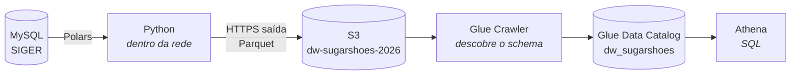
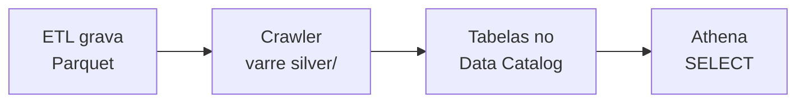

# Data warehouse na AWS

O DW vive em **S3 + Glue + Athena**. Não há servidor ligado: paga-se armazenamento
(centavos) e byte lido por consulta.



| | |
|---|---|
| **Região** | `sa-east-1` — América do Sul (São Paulo) |
| **Bucket** | `dw-sugarshoes-2026` |
| **Database** | `dw_sugarshoes` |
| **Crawler** | `crawler-dw-sugarshoes`, *On demand* |
| **Usuário do ETL** | `etl-dw-sugar` (chave de acesso, só S3) |
| **Role do Glue** | `AWSGlueServiceRole-dw-sugarshoes` |

!!! warning "Tudo é regional"
    Glue e Athena são serviços **por região**. Um crawler criado em `us-east-1` não
    enxerga um bucket em `sa-east-1` — e o erro que ele dá não diz isso. Confira o
    seletor de região antes de criar qualquer recurso.

---

## Layout do bucket

```text
s3://dw-sugarshoes-2026/
├── silver/
│   ├── DIM_CLIENTE/
│   │   └── DIM_CLIENTE.parquet
│   ├── DIM_PRODUTO/
│   │   └── DIM_PRODUTO.parquet
│   └── FATO_ESTOQUE/
│       ├── periodo=202608/FATO_ESTOQUE.parquet
│       ├── periodo=202607/FATO_ESTOQUE.parquet
│       └── …
└── athena-results/          ← resultados de consulta, FORA de silver/
```

!!! danger "`athena-results/` fica fora de `silver/`"
    Se ficasse dentro, o próximo crawler catalogaria os CSVs de resultado das suas
    consultas como se fossem tabelas do DW.

Uma tabela = uma pasta sob `silver/`. Uma partição = uma subpasta `coluna=valor/`.
O motivo do formato está em [Conceitos → Partição](conceitos.md#particao).

---

## Credenciais e IAM

Duas identidades, com papéis diferentes — e a confusão entre elas custa tempo:

| Identidade | Tipo | Para quê |
|---|---|---|
| `etl-dw-sugar` | **usuário** (chave + segredo) | o Python empurra Parquet |
| `AWSGlueServiceRole-dw-sugarshoes` | **função** (role) | o serviço Glue lê o bucket |

Usuário é para uma pessoa ou script, com chave. Função é para um serviço da AWS
assumir temporariamente, sem chave nenhuma.

### A política que o ETL precisa

```json
{
  "Version": "2012-10-17",
  "Statement": [
    {
      "Effect": "Allow",
      "Action": ["s3:GetObject", "s3:PutObject"],
      "Resource": "arn:aws:s3:::dw-sugarshoes-2026/*"
    },
    {
      "Effect": "Allow",
      "Action": ["s3:ListBucket", "s3:GetBucketLocation"],
      "Resource": "arn:aws:s3:::dw-sugarshoes-2026"
    }
  ]
}
```

!!! danger "Dois ARNs diferentes, e não é engano"
    `ListBucket` age sobre o **bucket** (ARN sem barra). `GetObject` age sobre os
    **objetos** (ARN terminando em `/*`). Trocar os dois é o erro de IAM mais comum
    que existe, e o sintoma é sempre `AccessDenied`.

!!! note "`list_buckets()` dar AccessDenied está CERTO"
    A política não concede `s3:ListAllMyBuckets` de propósito: o ETL não precisa
    enumerar a conta, só escrever no bucket dele. Use `list_objects_v2(Bucket=...)`
    para conferir a conexão.

### A role do Glue

A política gerenciada `AWSGlueServiceRole` libera S3 apenas em buckets cujo nome
começa com `aws-glue-`. Como o bucket se chama `dw-sugarshoes-2026`, **é obrigatório
anexar a política acima também** — senão o crawler roda, termina com sucesso e cria
zero tabelas.

!!! warning "Sucesso com zero tabelas"
    Foi exatamente o que aconteceu na primeira execução: `Completed` em 39 s,
    `Table changes: -`, catálogo vazio. Sem permissão de leitura, o crawler não vê
    nada — e "não vi nada" e "não pude ver" produzem o mesmo resultado.

---

## Catalogar e consultar



O crawler é **On demand**: rode-o depois de acrescentar uma tabela nova ou mudar o
schema de uma existente. Partições novas de uma tabela já catalogada não exigem
recrawl — o Athena as descobre pelo caminho.

### Validação depois de cada carga

```sql
-- grão íntegro
SELECT COUNT(*) linhas, COUNT(DISTINCT cliente) chaves FROM dim_cliente;

-- a partição está sendo usada? olhe "Dados verificados" nas estatísticas
SELECT COUNT(*) FROM fato_estoque WHERE periodo = 202608;

-- órfãos (roda para toda chave estrangeira)
SELECT COUNT(*) FROM dim_cliente c
LEFT JOIN dim_municipio m ON m.cod_ibge = c.cod_ibge
WHERE c.cod_ibge IS NOT NULL AND m.cod_ibge IS NULL;   -- 0
```

!!! tip "Trocar o schema de uma tabela"
    O catálogo guarda o schema descoberto. Se você mudar as colunas de uma tabela,
    **apague a tabela** em *Data Catalog tables* e rode o crawler de novo — senão ele
    tenta reconciliar o novo com o velho.

---

## Custo

Medido com o DW atual (13,5 MB, 49 objetos):

| Item | Volume | Custo/mês |
|---|---|---|
| S3 Standard | 13,5 MB | ~US$ 0,0005 |
| Glue Data Catalog | 4 tabelas | US$ 0 (grátis até 1 mi de objetos) |
| Crawler | 0,123 DPU-h por execução | ~US$ 0,05 por run |
| Athena | mínimo 10 MB por consulta | ~US$ 0,0001 por consulta |

Projetando o SIGER inteiro (495 GB) em Parquet comprimido, o S3 fica na casa de
**US$ 2–4/mês**. O que consome orçamento na AWS não é armazenamento — é máquina
ligada, e este desenho não tem nenhuma.

### As três armadilhas de custo

1. **`SELECT *` sem filtro de partição.** US$ 9 por TB lido em São Paulo. Defina um
   limite em *Athena → Workgroups → primary → Data usage controls* (comece com 1 GB):
   consultas que passarem disso são canceladas antes de custar.
2. **BI apontado direto no Athena.** Um refresh de hora em hora varre tudo, toda hora.
   Ver [Conceitos → camadas](conceitos.md#as-camadas-do-data-lake).
3. **Versionamento do bucket ligado.** O ETL sobrescreve as mesmas chaves todo dia;
   com versionamento, cada execução cria uma versão nova e o bucket cresce para
   sempre, cobrando pelo que você acha que apagou.

!!! tip "Ciclo de vida em `athena-results/`"
    Os resultados de consulta se acumulam indefinidamente. Uma regra de expiração em
    7 dias resolve — são arquivos pequenos, mas ninguém lembra deles um ano depois.

---

## Snowflake, e por que os dois convivem

`DESTINOS` conhece S3 e Snowflake, e `DW_DESTINOS` decide quais rodam. Não é
indecisão: são ferramentas para momentos diferentes.

| | S3 + Athena | Snowflake |
|---|---|---|
| Custo parado | ~zero | warehouse suspenso, mas com mínimos |
| Latência | 1–5 s | sub-segundo com cache |
| Concorrência | alta, sem contenção | depende do warehouse |
| Quando usa | histórico, exploração, construir o gold | análise interativa pesada |

Como a extração é a parte cara (13,0 s contra 0,20 s de particionamento), gravar nos
dois custa quase o mesmo que gravar em um: o `pipeline()` extrai **uma vez** e
distribui.
