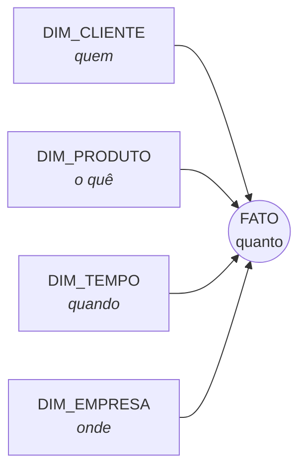
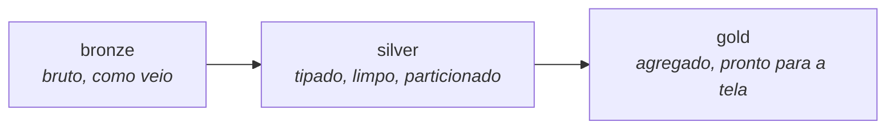

# Conceitos

Esta página explica **por que** o DW tem a forma que tem. As outras páginas descrevem
o que existe; esta descreve as decisões, com as medições que as sustentam.

---

## Por que um DW, se o ERP já tem os dados

O SIGER responde bem à pergunta *"qual é o saldo deste produto agora"*. Ele responde
mal a *"como o estoque desta marca evoluiu nos últimos 4 anos"* — e responder mal, num
ERP, significa competir por CPU com quem está faturando uma nota.

Três diferenças concretas:

| | ERP (SIGER) | DW |
|---|---|---|
| Pergunta típica | uma linha, agora | milhões de linhas, ao longo do tempo |
| Formato | normalizado, 3.182 tabelas | dimensional, ~15 tabelas |
| Custo de uma consulta ruim | o faturamento trava | um arquivo a mais lido |
| Histórico | o que não foi expurgado | tudo, para sempre |

E há a razão política, que costuma ser a decisiva: **o ERP é contratado**. Não dá para
criar índice, view materializada nem réplica dentro dele. O DW é a única superfície
que este projeto controla.

!!! warning "O ERP não se move"
    O Parquet nasce **dentro** da rede, onde o MySQL está, e é **empurrado** para o S3
    por HTTPS de saída. A AWS nunca entra na rede: não há VPN, não há porta aberta, e
    o ERP contratado não é tocado. Empurrar dado para fora é seguro; deixar alguém
    entrar, não.

---

## Modelagem dimensional (Kimball)

O modelo separa o mundo em duas coisas, e só duas:

- **Fato** — o que aconteceu, com números que somam. Uma linha por evento.
- **Dimensão** — o contexto do evento, com atributos que descrevem. Uma linha por
  entidade.



Uma consulta analítica é sempre a mesma forma: **somar a medida do fato, agrupando
pelos atributos das dimensões**. É por isso que o modelo é fácil de consultar sem
conhecer o ERP.

### Grão: a primeira decisão, e a que não se desfaz

**Grão** é o que uma linha do fato representa. `FATO_ESTOQUE` tem grão
*empresa × local × produto × período*: cada linha é o saldo de um produto, num local,
num mês.

Declarar o grão antes de escrever a query não é formalidade. Quase todo defeito grave
de DW é um grão que ninguém escreveu:

!!! danger "Fan-out: o erro que não dá erro"
    Juntar uma tabela de grão mais fino sem perceber **multiplica** os valores. Casos
    reais medidos neste grupo:

    - `nriven_ped` sem `tdr=1` → venda inflada **2,63×**
    - `view_comissao` contando só por produto → **2,66×**
    - `ninfat` sem `tdr=1` → faturamento **2,6×**
    - `eformu` sem colapsar revisão → 346 formulações duplicadas

    Nenhum desses levanta exceção. O número simplesmente fica maior, e alguém acredita.

**A defesa é sempre a mesma contagem:**

```sql
SELECT COUNT(*) FROM fato_x;                                 -- antes
SELECT COUNT(*) FROM fato_x JOIN dim_y USING (chave);        -- tem de ser igual
```

### Dimensão conformada

Uma dimensão é **conformada** quando a mesma linha significa a mesma coisa para todos
os fatos que a usam. É o que permite comparar venda com estoque na mesma tela.

No SIGER isso exigiu uma decisão: **o cadastro é replicado por empresa**. Medido em
31/08/2026 nas quatro empresas do grupo (`S01`, `S02`, `N03`, `N35`):

```
fcadas  (cliente) ...... 79.309 em CADA empresa
fcadas  (fornecedor) ... 13.178 em CADA empresa
nprodu  (produto) ...... 33.936 em CADA empresa
eformu  (formulação) ... 96.330 pares em CADA empresa
```

E, testando divergência de conteúdo entre as quatro — CNPJ, razão social, cidade,
representante, situação, marca, grupo, coleção:

```
divergências encontradas: 0
```

Por isso as dimensões **não carregam a coluna empresa** e leem apenas `N03`, a empresa
master. Carregar as quatro daria 317.236 linhas para descrever 79.309 clientes, e
obrigaria todo JOIN de fato a casar por empresa também — sob pena de multiplicar os
valores por 4.

!!! note "A empresa continua existindo"
    Ela fica **no fato**, onde é um atributo do evento (esta venda foi da S01), não na
    dimensão, onde seria só uma cópia.

### Chave natural, sem surrogate key

O padrão Kimball clássico usa uma *surrogate key* — um inteiro sequencial sem
significado. **Aqui não usamos**, por decisão explícita.

O motivo: uma SK gerada por contador quebraria o DW em silêncio. As dimensões são
recarregadas por inteiro a cada execução; a numeração sairia diferente, e as fatos já
gravadas passariam a apontar para o cliente errado — sem erro nenhum.

O que substitui as garantias que a SK daria:

1. **O nome da coluna-chave é o mesmo na dimensão e no fato.** Sempre `CLIENTE`,
   `PRODUTO`, `EMPRESA`, `COD_IBGE`. Assim o JOIN vira `USING (cliente)`, e o próprio
   SQL cobra a convenção.
2. **Chave composta se junta inteira.** `DIM_PRODUTO` tem grão `PRODUTO`; se um dia
   voltar a ter `EMPRESA`, juntar só por `PRODUTO` não dá erro — dá 4 linhas onde
   deveria haver 1.
3. **O tipo tem de bater.** No Parquet, um `CHAR(3)` vira string com espaço à direita
   (`'N03 '`), e no Athena o JOIN **não casa e não dá erro** — a linha some. Daí o
   `TRIM()` em toda coluna de texto que entra em chave.

!!! warning "O banco não garante relacionamento"
    Nem o MariaDB (sem FK declarada) nem o S3/Athena impõem integridade referencial.
    Quem garante é **o teste de órfãos**, e ele roda em toda carga:

    ```sql
    SELECT COUNT(*) FROM fato_x f
    LEFT JOIN dim_y d USING (chave)
    WHERE f.chave IS NOT NULL AND d.chave IS NULL;   -- tem de ser 0
    ```

### Regra de negócio mora na dimensão

`CNPJ_VALIDO` é uma coluna de `DIM_CLIENTE`, não um `WHERE` repetido em cada consulta.
O cadastro do SIGER usa placeholders — `00000000000191` (o CNPJ do Banco do Brasil)
aparece em **435 cadastros** — e sem a flag cada analista reinventaria a lista.

O mesmo vale para `EH_TRANSPORTADORA` em `DIM_FORNECEDOR`: em Kimball isso é um
*behavior tag*, um atributo derivado do comportamento observado nos fatos.

!!! tip "Behavior tag sem janela de tempo"
    A versão antiga marcava transportadora olhando CT-e **desde 2024-09-01**. Isso
    enfia uma janela de análise dentro da dimensão: quem emitiu em 2023 e parou
    desaparece, e o significado da coluna muda sozinho com o tempo.

    Sem a janela: 227 transportadoras contra 163, e **894 ms contra 5,3 s**.
    *"Emitiu nos últimos N meses"* é pergunta do fato, não atributo de cadastro.

---

## As camadas do data lake



| Camada | O que é | Quem lê |
|---|---|---|
| **bronze** | cópia crua da origem, sem tratamento | ninguém, no dia a dia — existe para reprocessar |
| **silver** | uma tabela por dimensão/fato, tipada e particionada | analista, Athena, construção do gold |
| **gold** | agregados prontos: meta por representante, carteira por cliente | a aplicação |

Hoje o projeto grava direto em **silver** — bronze só faria sentido quando houver
transformação pesada o bastante para valer reprocessar sem reextrair.

!!! danger "A aplicação não deve ler do Athena"
    O Athena é motor de varredura, não banco de aplicação: 1 a 5 segundos por consulta.
    Com o tráfego atual do Vertica (23.599 consultas/dia, **92% repetidas**), servir a
    aplicação por ele daria ~708 mil consultas/mês — caro e, principalmente, lento
    demais para um CRM.

    O caminho é **gold pequeno**, lido por DuckDB ou materializado num banco
    transacional. O Athena serve exploração e a construção do gold.

---

## Partição

Uma partição é uma pasta cujo **nome carrega o valor de uma coluna**:

```
silver/FATO_ESTOQUE/periodo=202608/FATO_ESTOQUE.parquet
silver/FATO_ESTOQUE/periodo=202607/FATO_ESTOQUE.parquet
```

O formato `chave=valor/` é o padrão **Hive**. Não é enfeite: com ele o Glue descobre a
coluna sozinho e o Athena lê **só as pastas do período pedido**. Sem ele, toda consulta
varre o histórico inteiro — e no Athena isso é dinheiro por consulta (US$ 9 por TB em
São Paulo).

!!! danger "A coluna de partição SAI do arquivo"
    O valor já está no caminho. Mantê-lo também dentro do Parquet faz o Glue montar a
    tabela com a coluna **duplicada**, e o Athena recusa a consulta inteira com
    `HIVE_INVALID_METADATA: Table descriptor contains duplicate columns`.

    É por isso que `carregar_s3()` faz `.drop(particao)` antes de gravar cada parte.

---

## Destino é configuração, não código

Um ETL declara **o que** extrai. **Onde** grava é decisão de configuração.

```python
# o módulo não sabe para onde vai
def executar() -> int:
    return pipeline(query, "DIM_CLIENTE")
```

```bash
# .env — muda os 12 ETLs de uma vez
DW_DESTINOS=s3,snowflake
```

Antes, cada dimensão trazia `destino=` e `arquivo_s3=` na chamada, e trocar o destino
do DW significava abrir 10 arquivos, um a um. O que tornou isso possível foi dar a
**todos os destinos a mesma assinatura** — `(df, tabela, particao=None)` —, e é por
isso que `carregar_snowflake()` recebe um `particao` que ignora.

!!! note "`particao` continua no módulo, e está certo"
    Partição é propriedade do **dado** (o estoque é mensal, aponte para onde apontar),
    não do destino. `destino=` era propriedade do destino, e por isso saiu.

Detalhes de implementação em [Arquitetura](arquitetura.md#destinos).

---

## Onde as decisões falham em silêncio

Um resumo do que este projeto já viu quebrar **sem levantar exceção** — vale como
lista de conferência antes de confiar num número novo:

| Sintoma | Causa |
|---|---|
| valor inflado 2–4× | fan-out: JOIN com grão mais fino |
| tabela some do catálogo | coluna de partição duplicada no Parquet |
| 46 arquivos viram 1 | chave do S3 sem `{coluna}={valor}/` |
| só o primeiro mês carrega | `return` dentro do laço de partição |
| filtro que nunca corta | valor errado na lista (`'KNIT'` onde o dado é `'KNT'`) |
| linha some no JOIN | `CHAR(3)` com espaço à direita, sem `TRIM()` |
| função não faz nada | corpo perdido no recorte-e-cola, sobrou só a docstring |
| consulta "vazia" | descoberta com `LIMIT` cortando o que se procurava |
