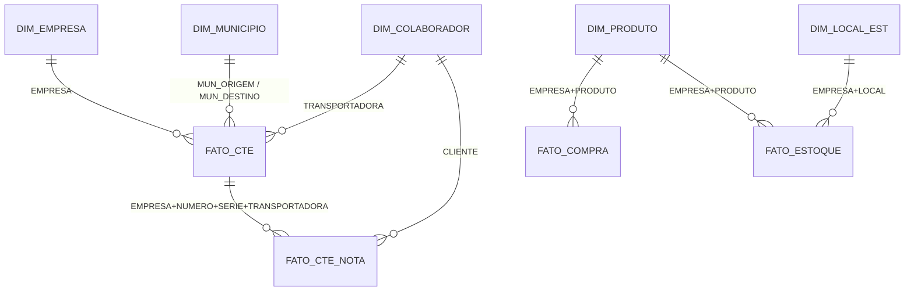

# Modelo de dados

Todas as tabelas são carregadas em **`SUGARSHOES.DW`** no Snowflake, em modo
*full refresh* — a tabela é substituída inteira a cada execução.

## Diagrama

## Escopo comum

Quase todas as queries compartilham dois filtros:

- **Empresas** — `S01`, `S02`, `N03`, `N35`. São as unidades ativas do grupo; as demais
  ficam de fora do DW.
- **Data de corte** — `>= '2024-09-01'` nos fatos transacionais e nas dimensões
  derivadas deles. Define o histórico que o DW cobre.

Alterar qualquer um dos dois exige editar cada arquivo de ETL individualmente — os
filtros estão escritos dentro do SQL, não centralizados.

---

## Dimensões

### `DIM_PRODUTO`

**Origem:** `nprodu` + `etbemp_mar` (marca) + `etbemp_tpf` (grupo)
**Grão:** um produto por empresa
**Volume observado:** ~135.000 linhas

| Coluna | Origem | Observação |
|---|---|---|
| `EMPRESA` | `npro_emp` | filtrado em `S01, S02, N03, N35` |
| `PRODUTO` | `npro_cod` | código do produto |
| `REFERENCIA` | `npro_ca1` | último segmento após o `.`, em maiúsculo |
| `DESCRICAO` | `npro_des` | |
| `MARCA_SIGLA` / `MARCA_NOME` | `etbemp_mar` | `LEFT JOIN` — pode vir nulo |
| `GRUPO_SIGLA` / `GRUPO_NOME` | `etbemp_tpf` | `LEFT JOIN` — pode vir nulo |

Os dois joins são `LEFT` de propósito: produto sem marca ou sem grupo cadastrado
continua aparecendo, com os atributos nulos.

### `DIM_LOCAL_EST`

**Origem:** `etbemp_loc`
**Grão:** um local de estoque por empresa

| Coluna | Origem | Observação |
|---|---|---|
| `EMPRESA` | `etbe_emp` | |
| `LOCAL` | `etbe_cloc` | **`etbe_cloc`, não `etbe_loc`** — a coluna vizinha existe e tem outro significado |
| `DESCRICAO` | `etbe_des001` | |
| `NAO_USAR` | derivada | `1` quando `LOCAL = 1`; flag para o BI descartar o local genérico |

!!! warning "Este ETL tem dois defeitos conhecidos"
    O arquivo `dim_local_est.py` grava em `DIM_PRODUTO` e sua `query` é uma tupla, não
    uma string. Veja [Pendências conhecidas](pendencias.md).

### `DIM_COLABORADOR`

**Origem:** `view_cliente_fornecedor_iprisma`, cruzada com `lmvliv` e `lobliv_nfc`
**Grão:** um colaborador (cliente ou fornecedor)

| Coluna | Origem | Observação |
|---|---|---|
| `COLABORADOR` | `Cod_colaborador` | |
| `RAZAO_SOCIAL` / `NOME_FANTASIA` | | |
| `CNPJ_CPF` | | |
| `CIDADE` / `UF` | | |
| `EH_TRANSPORTADORA` | derivada | `MAX()` sobre a subconsulta: `1` se aparece como transportadora em CT-e |

A dimensão **não** traz todos os colaboradores do ERP: o `JOIN` com a subconsulta
restringe àqueles que aparecem em algum documento desde `2024-09-01`. A subconsulta é
um `UNION` de duas origens — transportadoras de CT-e (`lmvliv`, marcadas com `1`) e
clientes das notas vinculadas (`lobliv_nfc`, marcados com `0`) — e o `MAX(eh_transp)`
resolve quem é as duas coisas a favor de "é transportadora".

### `DIM_MUNICIPIO`

**Origem:** `municipios_iprisma`
**Grão:** um município do IBGE

| Coluna | Origem | Observação |
|---|---|---|
| `COD_IBGE` | `Cod_IBGE_mun` | chave para `MUN_ORIGEM` / `MUN_DESTINO` em `FATO_CTE` |
| `MUNICIPIO` | `Descricao` | |
| `UF` | derivada | `CASE` sobre `FLOOR(cod / 100000)` — os dois primeiros dígitos do código IBGE identificam a UF |

O `CASE` cobre as 27 unidades federativas. Um código fora dessa lista produz `UF` nula.

### `DIM_EMPRESA`

**Origem:** `lmvliv`
**Grão:** uma empresa

| Coluna | Origem | Observação |
|---|---|---|
| `EMPRESA` | `LMVL_EMP` | |
| `CT_ES` | `COUNT(*)` | quantidade de linhas de CT-e da empresa na janela |

Diferente das outras, esta dimensão é derivada do movimento e não de um cadastro: só
aparecem empresas com CT-e de aquisição de transporte desde `2024-09-01`, e `CT_ES` é
uma contagem que muda a cada carga.

---

## Fatos

### `FATO_COMPRA`

**Origem:** `npedid` (pedido) ⋈ `nipfat` (item)
**Grão:** empresa × período (`AAAAMM`) × produto × combinação
**Volume observado:** ~49.000 linhas

| Coluna | Cálculo |
|---|---|
| `EMPRESA`, `PERIODO`, `PRODUTO`, `COMBINACAO` | chaves do grão — `PERIODO` vem de `DATE_FORMAT(nped_dte, '%Y%m') + 0`, virando inteiro |
| `QTD` | `ROUND(SUM(nipf_qtd), 3)` |
| `VALOR` | `ROUND(SUM(nipf_qtd * nipf_vun), 2)` |
| `NOTAS` | `COUNT(DISTINCT nped_cod)` |
| `CLIENTES` | `COUNT(DISTINCT nped_cli)` |

**Filtros que definem o que conta como compra:**

- `nped_pos <> 9` e `nipf_pos <> 9` — descarta registros cancelados
- `nped_ees IN (20, 22, 23, 37, 88)` — situações válidas do pedido
- `nipf_cfo IN (5101, 5401, 6101, 6107, 6109, 6118, 6151, 7101, 7127)` — CFOPs de venda/remessa considerados
- `nped_dte >= '2024-09-01'`

### `FATO_ESTOQUE`

**Origem:** `eacumu` (acumulado de estoque)
**Grão:** empresa × período × produto × local × combinação
**Volume observado:** 1,6 a 2,0 milhões de linhas — de longe o maior ETL

| Coluna | Origem |
|---|---|
| `EMPRESA`, `PERIODO`, `PRODUTO`, `LOCAL`, `COMBINACAO` | chaves do grão |
| `SALDO_QTD` / `SALDO_VALOR` | `eacu_qfi` / `eacu_vto` |
| `ENTRADA_QTD` / `ENTRADA_VALOR` | `eacu_qet` / `eacu_vet` |
| `SAIDA_QTD` / `SAIDA_VALOR` | `eacu_qsa` / `eacu_vsa` |
| `ULT_ALTERACAO` | `eacu_datult` |

Único fato **sem** corte por data: traz todo o histórico acumulado das quatro empresas.
É o que explica o volume, e é onde o ganho do caminho Arrow mais aparece.

### `FATO_CTE`

**Origem:** `lmvliv` (livro de movimento fiscal)
**Grão:** empresa × número × série × transportadora × CFOP × sequência × município de origem × município de destino
**Escopo:** CFOP `1352` e `2352` — aquisição de serviço de transporte

| Coluna | Cálculo |
|---|---|
| `EMPRESA`, `NUMERO`, `SERIE`, `TRANSPORTADORA`, `CFOP`, `SEQ` | chaves do documento |
| `MUN_ORIGEM` / `MUN_DESTINO` | `LMVL_CMUR` / `LMVL_CMUD` — juntam com `DIM_MUNICIPIO.COD_IBGE` |
| `DT_EMISSAO` / `DT_MOVIMENTO` | `MIN()` sobre as linhas agrupadas |
| `MODELO` | `MAX(LMVL_MDF)` |
| `VALOR_FRETE` | `ROUND(SUM(LMVL_VAL), 2)` |
| `BASE_ICMS` / `VALOR_ICMS` | `ROUND(SUM(LMVL_BICM), 2)` / `ROUND(SUM(LMVL_VICM), 2)` |

O `GROUP BY 1,2,3,4,5,6,9,10` agrupa pelas chaves e pelos municípios; datas e modelo
entram como `MIN`/`MAX` porque são constantes dentro do grupo — o agregado serve apenas
para satisfazer o `GROUP BY`.

### `FATO_CTE_NOTA`

**Origem:** `lobliv_nfc` (notas vinculadas ao conhecimento)
**Grão:** uma nota fiscal dentro de um CT-e
**Volume observado:** ~111.000 linhas

| Coluna | Cálculo |
|---|---|
| `EMPRESA`, `NUMERO`, `SERIE`, `TRANSPORTADORA`, `CFOP` | identificam o **CT-e** — ligam a `FATO_CTE` |
| `NOTA`, `NOTA_SERIE`, `CLIENTE` | identificam a **nota transportada** |
| `CFOP_NOTA` | `MAX(LOBL_NOP)` — CFOP da nota, não do CT-e |
| `SENTIDO` | `'SAIDA'` se `CFOP_NOTA >= 5000`, senão `'ENTRADA'` |
| `EH_DEVOLUCAO` | `1` quando `MOD(CFOP_NOTA, 1000) IN (201, 202, 203, 204, 410, 411)` |
| `DT_NOTA` | `MIN(LOBL_DTC)` |
| `VALOR_NOTA` | `ROUND(SUM(LOBL_VAC), 2)` |

As duas colunas derivadas usam a estrutura do CFOP brasileiro: o primeiro dígito indica
o sentido da operação (1–3 entrada, 5–7 saída) e os três últimos, a natureza — daí o
`MOD(..., 1000)` para detectar devolução independentemente de ser interna, interestadual
ou de exterior.

!!! tip "Relacionando os dois fatos de CT-e"
    `FATO_CTE` tem uma linha por conhecimento; `FATO_CTE_NOTA`, uma linha por nota
    dentro dele. A junção é pela quádrupla
    `EMPRESA + NUMERO + SERIE + TRANSPORTADORA`. Somar `VALOR_NOTA` e comparar com
    `VALOR_FRETE` do mesmo CT-e é a checagem de consistência mais direta entre eles.
